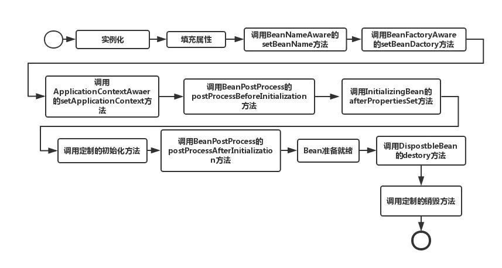
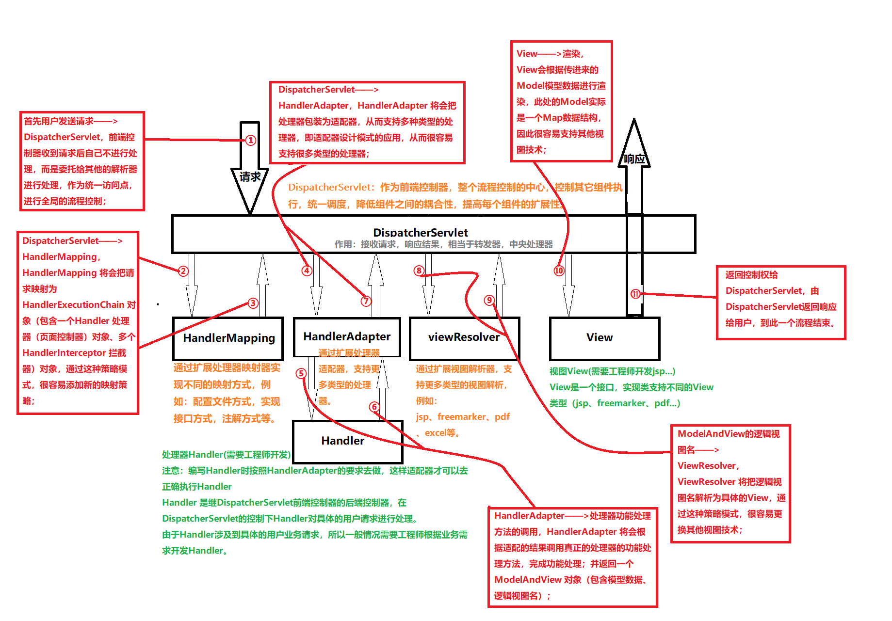

# 文章

[Spring 面试](https://juejin.im/post/5e6d993cf265da575b1bd4af)

[Spring 相关知识点](https://blog.csdn.net/fuzhongmin05/article/details/106083203)

[Spring 注解大全](http://www.jiangxinlingdu.com/spring/2019/02/11/annotation.html)

[Spring boot 启动过程解析](http://www.jiangxinlingdu.com/spring/2019/08/31/springboot-start.html)

# [Spring IOC](https://juejin.im/post/5b040cf66fb9a07ab7748c8b)

## Bean的加载

- [Bean的加载过程](https://juejin.im/post/5b040cf66fb9a07ab7748c8b)
- [一文搞懂Bean的加载过程](https://juejin.im/post/5ccff60d6fb9a032447f0c8e)
- [Spring 循环依赖](https://zhuanlan.zhihu.com/p/62382615)

加载过程： 通过 `ResourceLoader` 和其子类 `DefaultResourceLoader` 完成资源文件位置定位，实现从类路径，文件系统，url等方式定位功能，完成定位后得到 `Resource` 对象，再交给 `BeanDefinitionReader` ，它再委托给 `BeanDefinitionParserDelegate` 完成 bean 的解析并得到 `BeanDefinition` 对象，然后通过 `registerBeanDefinition` 方法进行注册，IOC容器内ibu维护了一个HashMap来保存该 `BeanDefinition` 对象，Spring中的BeanDefinition其实就是我们用的JavaBean。

## 注入方式

[Spring注入Bean的几种方式](https://juejin.im/post/5ca81a536fb9a05e6538aa39)

- @Configuration 注解注入
- 构造器注入
- Setter方法注入
- 通过属性名直接注入

## [spring 统一资源加载策略](https://my.oschina.net/u/4055223/blog/3098311)

## [FactoryBean 与 BeanFactory](https://juejin.im/post/5da590c35188252d3a44a8ea)
- 他们两个都是个工厂，但FactoryBean本质上还是一个Bean，也归BeanFactory管理
- BeanFactory是Spring容器的顶层接口，FactoryBean更类似于用户自定义的工厂接口。

## [BeanFactory和ApplicationContext](https://juejin.im/post/5bc08e4bf265da0a972e435d)
1. BeanFactory负责读取bean配置文档，管理bean的加载，实例化，维护bean之间的依赖关系，负责bean的声明周期。
2. ApplicationContext除了提供上述BeanFactory所能提供的功能之外，还提供了更完整的框架功能：
    - 国际化支持
    - 资源访问
    - 事件传递：通过实现ApplicationContextAware接口
3. 常用的获取ApplicationContext
    - FileSystemXmlApplicationContext：从文件系统或者url指定的xml配置文件创建，参数为配置文件名或文件名数组，有相对路径与绝对路径。
    - ClassPathXmlApplicationContext：从classpath的xml配置文件创建，可以从jar包中读取配置文件。
    - XmlWebApplicationContext：从web应用的根目录读取配置文件，需要先在web.xml中配置，可以配置监听器或者servlet来实现
    
## [Spring Aware](https://www.jianshu.com/p/73981795cfa4)

在实际的项目中，我们不可避免的要用到Spring容器本身的功能资源，这时候Bean必须要意识到Spring容器的存在，才能调用Spring所提供的资源，这就是所谓的Spring Aware。其实Spring Aware本来就是Spring设计用来框架内部使用的，若使用了Spring Aware，你的Bean将会和Spring框架耦合。

## [Bean的生命周期](https://yemengying.com/2016/07/14/spring-bean-life-cycle/)

## [Bean的作用域](https://juejin.im/post/5dad1455f265da5b6006fa6a)

- singleton: spring IoC容器存在一个bean对象实例。
- prototype: 与单例相反，每次请求bean时，它都会创建一个新实例。
- request: 在HTTP请求(Request) 的完整生命周期中，将创建并使用单个实例。 只适用于web环境中Spring ApplicationContext中有效。
- session: 在HTTP会话(Session) 的完整生命周期中，将创建并使用单个实例。 只适用于web环境中Spring ApplicationContext中有效。
- application: 将在ServletContext的完整生命周期中创建并使用单个实例。只适用于web环境中Spring ApplicationContext中有效。
- websocket: 在WebSocket的完整生命周期中，将创建并使用单个实例。 只适用于web环境中Spring ApplicationContext中有效。

## [自动装配歧义性](https://juejin.im/post/5d5f3c42f265da03dc0776c4)

- @Primary
- @Qualifier

## [自动装配方式](https://juejin.im/post/5c84b5285188257c5b477177)
- no：默认的方式是不进行自动装配，通过显式设置ref 属性来进行装配。
- byName：通过参数名 自动装配，Spring容器在配置文件中发现bean的autowire属性被设置成byName，之后容器试图匹配、装配和该bean的属性具有相同名字的bean。
- byType：通过参数类型自动装配，Spring容器在配置文件中发现bean的autowire属性被设置成byType，之后容器试图匹配、装配和该bean的属性具有相同类型的bean。如果有多个bean符合条件，则抛出错误。
- constructor：这个方式类似于byType， 但是要提供给构造器参数，如果没有确定的带参数的构造器参数类型，将会抛出异常。
- autodetect：首先尝试使用constructor来自动装配，如果无法工作，则使用byType方式。

默认是使用 byType 的方式进行装配的

## [Bean 的线程安全性](https://juejin.im/post/5a0045ef5188254de169968e)

Spring根本就没有对bean的多线程安全问题做出任何保证与措施。对于每个bean的线程安全问题，根本原因是每个bean自身的设计。不要在bean中声明任何有状态的实例变量或类变量，如果必须如此，那么就使用ThreadLocal把变量变为线程私有的.

# [Spring AOP](https://juejin.im/post/5b06bf2df265da0de2574ee1)
- [相关概念及范例](https://juejin.im/post/5a3201ff6fb9a0450f21f3ea)

# [Spring MVC](https://juejin.im/post/5d88267c5188253f0f61dc5b)

### [Spring MVC 流程](https://juejin.im/post/5c0f6a60518825080825aae7)

### [Spring MVC常用注解](https://my.oschina.net/u/3739863/blog/1815500)

### [Spring MVC 拦截器](https://juejin.im/post/5a5c6cad51882573514f6b38)

### [SpringBoot实现过滤器、拦截器与切片](https://juejin.im/post/5c6901206fb9a049af6dcdcf)

### [Spring MVC 异常处理](http://imushan.com/2017/11/27/java/spring/Spring%E7%AC%94%E8%AE%B0-%E5%BC%82%E5%B8%B8%E5%A4%84%E7%90%86/)

# [Spring 事务](https://juejin.im/post/5ebe682c5188256d8a22940f)

- [Spring 事务传播机制](https://github.com/love-somnus/Spring/wiki/Spring%E4%BA%8B%E5%8A%A1%E7%9A%84%E4%BC%A0%E6%92%AD%E7%89%B9%E6%80%A7)

### [@Transactional注解的失效场景](https://juejin.im/post/5e72e97c6fb9a07cb346083f)

# [Spring EL](http://itmyhome.com/spring/expressions.html)

- [Async注解](https://developer.aliyun.com/article/768513)
