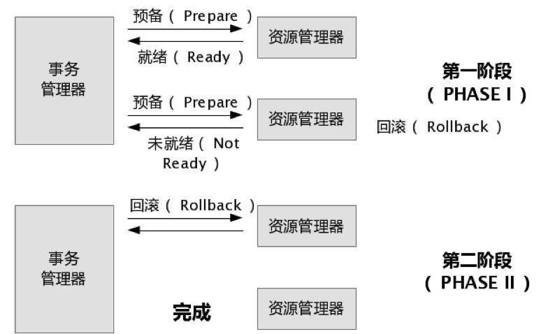
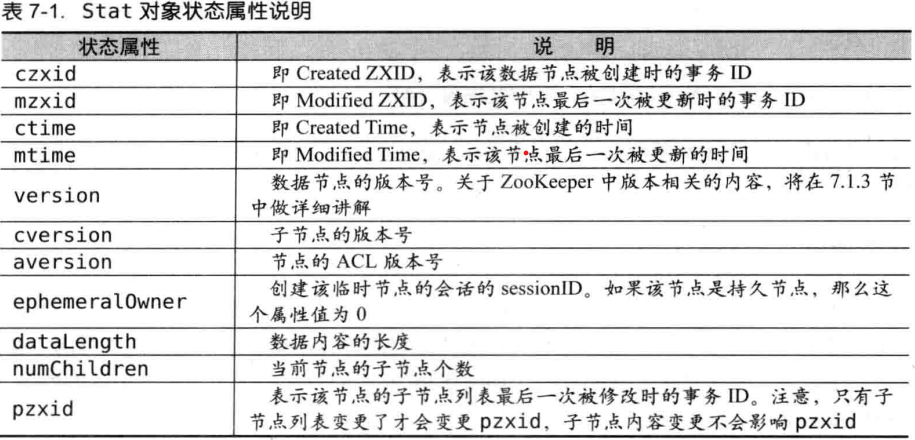

# ZooKeeper

## [分布式事务](https://juejin.im/post/5c9443406fb9a070fe0dd9a9)

### ACID

    A: Atomicity，原子性
    C: Consistency，一致性
    I: Isolation，隔离性
    D: Durability，持久性
   
### CAP

    C：Consistency，一致性, 数据一致更新，所有数据变动都是同步的
    A：Availability，可用性, 好的响应性能，完全的可用性指的是在任何故障模型下，服务都会在有限的时间处理响应
    P：Partition tolerance，分区容错性，可靠性
    
帽子理论证明，任何分布式系统只可同时满足二点，没法三者兼顾。

### BASE
BASE模型与ACID模型截然不同，满足CAP理论，通过牺牲强一致性，获得可用性，一般应用在服务化系统的应用层或者大数据处理系统，通过达到最终一致性来尽量满足业务的绝大部分需求。
BASE模型包含个三个元素：

    BA：Basically Available，基本可用
    S：Soft State，软状态，状态可以有一段时间不同步
    E：Eventually Consistent，最终一致，最终数据是一致的就可以了，而不是时时保持强一致

BASE模型的软状态是实现BASE理论的方法，基本可用和最终一致是目标。按照BASE模型实现的系统，由于不保证强一致性，系统在处理请求的过程中，可以存在短暂的不一致，在短暂的不一致窗口请求处理处在临时状态中，系统在做每步操作的时候，通过记录每一个临时状态，在系统出现故障的时候，可以从这些中间状态继续未完成的请求处理或者退回到原始状态，最后达到一致的状态

### 2PC

1. 准备阶段：协调者向参与者发起指令，参与者评估自己的状态，如果参与者评估指令可以完成，参与者会写redo或者undo日志（这也是前面提起的Write-Ahead Log的一种），然后锁定资源，执行操作，但是并不提交

2. 提交阶段：如果每个参与者明确返回准备成功，也就是预留资源和执行操作成功，协调者向参与者发起提交指令，参与者提交资源变更的事务，释放锁定的资源；如果任何一个参与者明确返回准备失败，也就是预留资源或者执行操作失败，协调者向参与者发起中止指令，参与者取消已经变更的事务，执行undo日志，释放锁定的资源

优缺点:

- 阻塞：从上面的描述来看，对于任何一次指令必须收到明确的响应，才会继续做下一步，否则处于阻塞状态，占用的资源被一直锁定，不会被释放
- 单点故障：如果协调者宕机，参与者没有了协调者指挥，会一直阻塞，尽管可以通过选举新的协调者替代原有协调者，但是如果之前协调者在发送一个提交指令后宕机，而提交指令仅仅被一个参与者接受，并且参与者接收后也宕机，新上任的协调者无法处理这种情况
- 脑裂：协调者发送提交指令，有的参与者接收到执行了事务，有的参与者没有接收到事务，就没有执行事务，多个参与者之间是不一致的

### 3PC

1. 询问阶段：协调者询问参与者是否可以完成指令，协调者只需要回答是还是不是，而不需要做真正的操作，这个阶段超时导致中止
2. 准备阶段：如果在询问阶段所有的参与者都返回可以执行操作，协调者向参与者发送预执行请求，然后参与者写redo和undo日志，执行操作，但是不提交操作；如果在询问阶段任何参与者返回不能执行操作的结果，则协调者向参与者发送中止请求，这里的逻辑与两阶段提交协议的的准备阶段是相似的，这个阶段超时导致成功
3. 提交阶段：如果每个参与者在准备阶段返回准备成功，也就是预留资源和执行操作成功，协调者向参与者发起提交指令，参与者提交资源变更的事务，释放锁定的资源；如果任何一个参与者返回准备失败，也就是预留资源或者执行操作失败，协调者向参与者发起中止指令，参与者取消已经变更的事务，执行undo日志，释放锁定的资源，这里的逻辑与两阶段提交协议的提交阶段一致

然而，这里与两阶段提交协议有两个主要的不同：

增加了一个询问阶段，询问阶段可以确保尽可能早的发现无法执行操作而需要中止的行为，但是它并不能发现所有的这种行为，只会减少这种情况的发生
在准备阶段以后，协调者和参与者执行的任务中都增加了超时，一旦超时，协调者和参与者都继续提交事务，默认为成功，这也是根据概率统计上超时后默认成功的正确性最大

三阶段提交协议与两阶段提交协议相比，具有如上的优点，但是一旦发生超时，系统仍然会发生不一致，只不过这种情况很少见罢了，好处就是至少不会阻塞和永远锁定资源。

## [paxos](https://zhuanlan.zhihu.com/p/31780743)

1. `proposal` 向 多个 `accepter` 询问编号为 `n` 的草案内容
2. 各个 `accepter` 向 `proposal` 响应已接受的最大的草案的编号和内容
3. `proposal` 从所有的响应中选取最大编号对应的草案内容作为 `n` 号草案的内容发往所有的 `accepter`
4. 如果 `n` 大于当前记录的最大草案编号, 那么草案就会通过. 并响应 `proposal` 当前的草案号
5. 如果所有的响应都为 `n` , 那么草案就会通过, 否则会开启新一轮的草案提起.

## [ZAB协议](https://juejin.im/post/5e97a617e51d4546f5790ef1)

## [应用场景](https://zhuanlan.zhihu.com/p/59669985)
1. 数据发布/订阅
2. 负载均衡
3. 命名服务
4. Master选举
5. 分布式锁
6. 集群管理
## 系统模型
### 节点状态

### [watcher机制](https://www.jianshu.com/p/4c071e963f18)

