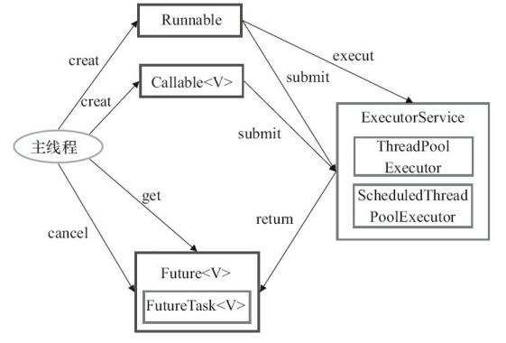

# 并发

## 并发与并行

- 并法: 并发是在单位时间段内, 多个线程同时运行, 同一时刻只有单个线程在运行
- 并行: 并行是在单位时间内,多个线程同时运行, 同一时刻多个线程在运行

并发是多个线程采用时间片轮换的方式抢占一个 CPU 的使用权, 并行需要多核 CPU 的支持.

## 线程

### 线程与进程的区别

- 定义方面：进程是程序在某个数据集合上的一次运行活动；线程是进程中的一个执行路径。（进程可以创建多个线程）
- 角色方面：在支持线程机制的系统中，进程是系统资源分配的单位，线程是CPU调度的单位。
- 资源共享方面：进程之间不能共享资源，而线程共享所在进程的地址空间和其它资源。同时线程还有自己的栈和栈指针，程序计数器等寄存器。
- 独立性方面：进程有自己独立的地址空间，而线程没有，线程必须依赖于进程而存在。
- 开销方面。进程切换的开销较大。线程相对较小。（前面也提到过，引入线程也出于了开销的考虑。）


### 实现线程的几种方式

1. 继承 `Thread`
```java
public class MyThread extends Thread {
    public MyThread(){}
    @overrider
    public void run(){
        System.out.print("MyThread");
        }
    public void static main(String[] args){
        MyThread t = new MyThread();
        t.start()
    }
}
```
缺点: 不支持继承其它类

2. 实现 `Runable` 接口
```java
public MyThread implements Runnable{
    public MyThread(){}
    @Override
    public void run() {
         System.out.print("MyThread");
    }
    public void static main(String[] args){
        MyThread t = new MyThread();
        new Thread(t).start
    }
}
```
3. 定时器

```java
public static void main(String[] args) throws Exception {
        // 创建定时器
        Timer timer = new Timer();
        // 提交计划任务
        timer.schedule(new TimerTask() {
            @Override
            public void run() {
                System.out.println("定时任务执行了...");
            }
        }, format.parse("2017-10-11 22:00:00"));
    }
```

4. 实现 Callable 接口

- 创建一个类实现Callable接口，实现call方法。这个接口类似于Runnable接口，但比Runnable接口更加强大，增加了异常和返回值
- 创建一个FutureTask，指定Callable对象，做为线程任务
- 创建线程，指定线程任务
- 启动线程

```java
 public static void main(String[] args) throws Exception {

        // 创建线程任务
        Callable call = () -> {
            System.out.println("线程任务开始执行了....");
        };
        // 将任务封装为FutureTask
        FutureTask task = new FutureTask(call);
        // 开启线程，执行线程任务
        new Thread(task).start();
    }
```

5. 线程池
```java
public static void main(String[] args) throws Exception {

        // 创建固定大小的线程池
        ExecutorService threadPool = Executors.newFixedThreadPool(10);

        while (true) {
            // 提交多个线程任务，并执行
            threadPool.execute(new Runnable() {
                @Override
                public void run() {
                    printThreadInfo();
                }
            });
        }
    }
```

### 线程状态


Java语言中定义了5种线程状态，在任意一个时间点，一个线程只能有且只有其中一种状态，这5种状态是：

- 新建（New）：创建后尚未启动的线程处于这种状态。
- 运行（Runable）：包括了操作系统线程状态中的Running和Ready，也就是处于此状态的线程有可能正在执行，也有可能正在等待着CPU为它分配执行时间。
- 无限期等待（Waiting）：处于这种状态的线程不会被分配CPU执行时间，它们要等待被其他线程显式地唤醒。以下方法会让线程陷入无限期的等待状态：
  - 没有设置timeout参数的Object.wait()方法；
  - 没有设置timeout参数的Thread.join()方法；
  - LockSupport.park()方法；

- 限期等待（Timed Waiting）：处于这种状态的线程也不会被分配CPU执行时间，不过无须等待被其他线程显式地唤醒，在一定时间之后它们会由操作系统自动唤醒。以下方法会让线程进入限期等待状态：
Thread.sleep()方法

  - 设置了timeout参数的Object.wait()方法；
  - 设置了timeout参数的Thread.join()方法；
  - LockSupport.parkNanos()方法；
  - LockSupport.parkUntil()方法；

- 阻塞（Blocked）：线程被阻塞了，“阻塞状态”与“等待状态”的区别是：“阻塞状态”在等待着获取到一个排它锁，这个事件将在另外一个线程放弃这个锁的时候发生；而“等待状态”则是在等待一段时间，或者唤醒动作的发生。在程序等待进入同步区域（synchronized）的时候，线程将进入这种状态。
- 结束（Terminated）：已终止的线程状态，线程已经结束执行。

### 几种方法的比较

- `Object.wait()`: 线程进入休眠状态, 释放已经获取的锁, 进入等待队列, 自己唤醒或其它线程通过 `notify()` `notifyAll` 唤醒
- `Thread.sleep()`: 线程进入超时等待状态, 不释放已获取的锁, 在休眠时间过后, 自己唤醒.
- `Thread.yield()`: 当前线程释放CPU时间片，但不释放锁资源，由运行状态变为就绪状态，并立即同其它线程抢时间片
- `Object.notigy()`: 随机唤醒一个休眠线程


### Java 守护线程

- 用户线程：我们平常创建的普通线程。

- 守护线程：用来服务于用户线程；不需要上层逻辑介入。

#### 使用它需要注意些什么？
- thread.setDaemon(true)必须在thread.start()之前设置，否则会跑出一个IllegalThreadStateException异常。你不能把正在运行的常规线程设置为守护线程。
- 在Daemon线程中产生的新线程也是Daemon的。
- 守护线程不能用于去访问固有资源，比如读写操作或者计算逻辑。因为它会在任何时候甚至在一个操作的中间发生中断。
- Java自带的多线程框架，比如ExecutorService，会将守护线程转换为用户线程，所以如果要使用后台线程就不能用Java的线程池。

当主线程结束时，结束其余的子线程（守护线程）自动关闭，就免去了还要继续关闭子线程的麻烦。如：Java垃圾回收线程就是一个典型的守护线程；内存资源或者线程的管理，但是非守护线程也可以。

## 线程池

### 使用线程池的目的

- 线程是稀有资源,不能频发的创建消耗
- 解耦,线程的创建和执行分开,方便维护
- 复用线程

### Executor 框架

executor 框架结构主要由 任务(`Runnable/Callable`), 任务的执行(`Executor`), 异步结果的获取(`Fature`) 三大部分组成





### ThreadPoolExecutor类分析

```java
/**
     * 用给定的初始参数创建一个新的ThreadPoolExecutor。
     */
    public ThreadPoolExecutor(int corePoolSize,//线程池的核心线程数量
                              int maximumPoolSize,//线程池的最大线程数
                              long keepAliveTime,//当线程数大于核心线程数时，多余的空闲线程存活的最长时间
                              TimeUnit unit,//时间单位
                              BlockingQueue<Runnable> workQueue,//任务队列，用来储存等待执行任务的队列
                              ThreadFactory threadFactory,//线程工厂，用来创建线程，一般默认即可
                              RejectedExecutionHandler handler//拒绝策略，当提交的任务过多而不能及时处理时，我们可以定制策略来处理任务
                               ) {
        if (corePoolSize < 0 ||
            maximumPoolSize <= 0 ||
            maximumPoolSize < corePoolSize ||
            keepAliveTime < 0)
            throw new IllegalArgumentException();
        if (workQueue == null || threadFactory == null || handler == null)
            throw new NullPointerException();
        this.corePoolSize = corePoolSize;
        this.maximumPoolSize = maximumPoolSize;
        this.workQueue = workQueue;
        this.keepAliveTime = unit.toNanos(keepAliveTime);
        this.threadFactory = threadFactory;
        this.handler = handler;
    }
```

**核心参数**

- `corePoolSize`: 指定最小可同时运行的线程数量
- `maximumPoolSize`: 当队列中存放的任务数量达到队列容量时, 当前可同时运行的线程数量变为最大线程数
- `workQueue`: 当前无空闲的核心线程, 任务加入队列等待

**其它参数**

- keepAliveTime:当线程池中的线程数量大于 corePoolSize 的时候，如果这时没有新的任务提交，核心线程外的线程不会立即销毁，而是会等待，直到等待的时间超过了 keepAliveTime才会被回收销毁；
- unit : keepAliveTime 参数的时间单位。
- threadFactory :executor 创建新线程的时候会用到。
- handler :饱和策略。关于饱和策略下面单独介绍一下。

**饱和策略**

- ThreadPoolExecutor.AbortPolicy：抛出 RejectedExecutionException来拒绝新任务的处理。
- ThreadPoolExecutor.CallerRunsPolicy：调用执行自己的线程运行任务，也就是直接在调用execute方法的线程中运行(run)被拒绝的任务，如果执行程序已关闭，则会丢弃该任务。因此这种策略会降低对于新任务提交速度，影响程序的整体性能。另外，这个策略喜欢增加队列容量。如果您的应用程序可以承受此延迟并且你不能任务丢弃任何一个任务请求的话，你可以选择这个策略。
- ThreadPoolExecutor.DiscardPolicy： 不处理新任务，直接丢弃掉。
- ThreadPoolExecutor.DiscardOldestPolicy： 此策略将丢弃最早的未处理的任务请求。

推荐使用 `ThreadPoolExecutor` 创建线程池, 直接使用 `Executor` 创建线程池可能会带来问题

- FixedThreadPool 和 SingleThreadExecutor ： 允许请求的队列长度为 Integer.MAX_VALUE,可能堆积大量的请求，从而导致 OOM。
- CachedThreadPool 和 ScheduledThreadPool ： 允许创建的线程数量为 Integer.MAX_VALUE ，可能会创建大量线程，从而导致 OOM。

### 线程池大小的确定

线程池太小会,在有大量任务/请求需要处理时, 大量任务/请求在任务队列中排队执行, 甚至出现队列满了仍然有大量任务/请求无法处理的情况.
线程池太大, 大量的线程可能会同时竞争CPU, 造成大量的上下文切换, 影响整体执行效率

当一个线程的时间片用完的时候就会重新处于就绪状态让给其他线程使用，这个过程就属于一次上下文切换。概括来说就是：当前任务在执行完 CPU 时间片切换到另一个任务之前会先保存自己的状态，以便下次再切换回这个任务时，可以再加载这个任务的状态。任务从保存到再加载的过程就是一次上下文切换。

- **CPU密集型任务(N+1)**: 这种任务消耗的主要时CPU资源, 可以将线程数设置为 N（CPU 核心数）+1，比 CPU 核心数多出来的一个线程是为了防止线程偶发的缺页中断，或者其它原因导致的任务暂停而带来的影响。
- **I/O密集型任务(2N)**:  这种任务应用起来，系统会用大部分的时间来处理 I/O 交互，而线程在处理 I/O 的时间段内不会占用 CPU 来处理，这时就可以将 CPU 交出给其它线程使用。因此在 I/O 密集型任务的应用中，我们可以多配置一些线程，具体的计算方法是 2N。
