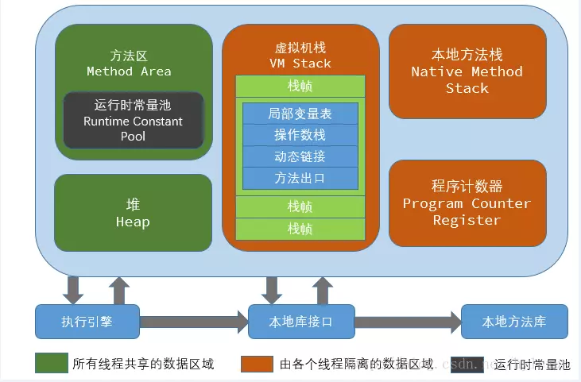
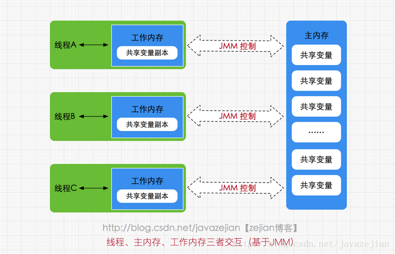
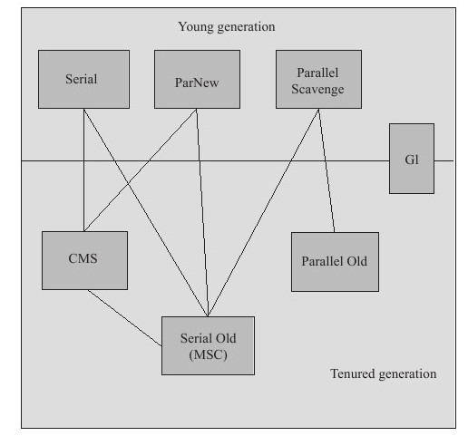
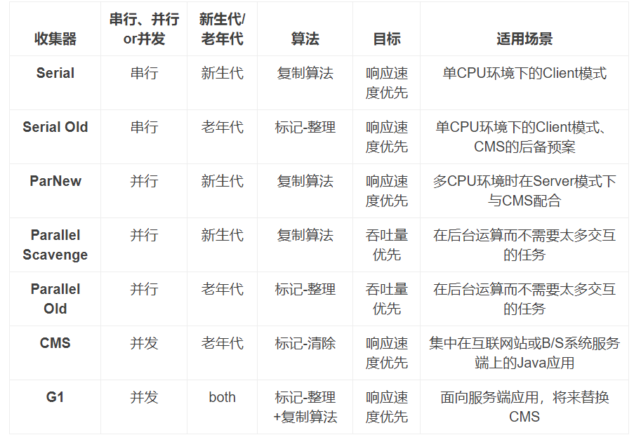
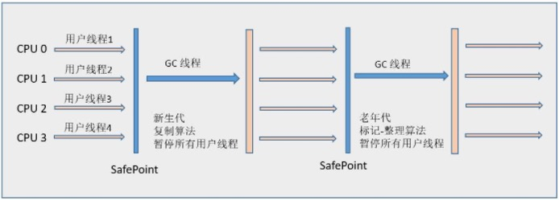
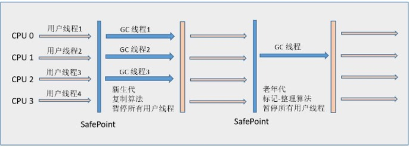
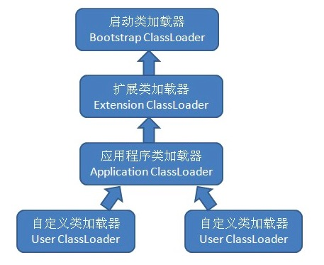
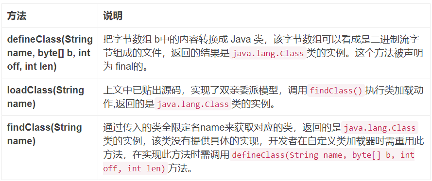

# Java底层

## JVM内存结构

### Class 文件结构

[详情](https://juejin.im/post/5a112f9551882535cd4a6c38)

### 运行时数据区

[详情](https://crowhawk.github.io/2017/08/09/jvm_1/)

根据 JVM 规范，JVM 内存共分为虚拟机栈、堆、方法区、程序计数器、本地方法栈五个部分。

- **虚拟机栈**（线程私有）

  每个线程有一个私有的栈，随着线程的创建而创建。栈里面存放着一种叫做“栈帧”的东西，每个方法在执行的时候会创建一个栈帧，存储了局部变量表(基本数据类型和对象引用)，操作数栈，动态连接，方法出口等信息。
每个方法从调用到执行完毕，对应一个栈帧在虚拟机栈中的入栈和出栈。
通常所说的栈，一般是指虚拟机栈中的局部变量表部分。局部变量表所需的内存在编译期间完成分配。
栈的大小可以固定也可以动态扩展，当扩展到无法申请足够的内存，则OutOfMemoryError。
当栈调用深度大于JVM所允许的范围，会抛出StackOverflowError的错误，不过这个深度范围不是一个恒定的值

- **本地方法栈**（线程私有）

  和虚拟机栈类似，主要为虚拟机使用到的Native方法服务。 也会抛出StackOverflowError和OutOfMemoryError。

- **PC寄存器**（线程私有）

  PC寄存器，也叫程序计数器。JVM支持多个线程同时运行，每个线程都有自己的程序计数器。倘若当前执行的是JVM方法，则该寄存器中保存当前执行指令的地址；倘若执行的是native方法，则PC寄存器为空。
这个内存区域是唯一一个在虚拟机中没有规定任何OutOfMemoryError情况的区域。

- **堆**（线程共享）

  堆内存是JVM所有线程共享的部分，在虚拟机启动的时候就已经创建。
和程序开发密切相关，应用系统对象都保存在Java堆中。所有的对象和数组都在堆上进行分配。这部分空间可通过GC进行回收。
对分代GC来说，堆也是分代的，是GC的主要工作区间。
当申请不到空间时，会抛出OutOfMemoryError。

- **方法区**（线程共享）

  方法区也是所有线程共享的。它用于存放已被虚拟机加载的类信息、常量、静态变量、JIT编译后的代码等数据。
这个区域的内存回收目标主要针对常量池的回收和对类型的卸载。
当方法区无法满足内存分配需求时，则抛出OutOfMemoryError异常。
在HotSpot虚拟机中，用永久代来实现方法区，将GC分代收集扩展至方法区，但是这样容易遇到内存溢出的问题。

  JDK1.7中，已经把放在永久代的字符串常量池移到堆中。

  JDK1.8撤销永久代，引入元空间。

- **直接内存**

  直接内存（Direct Memory）并不是虚拟机运行时数据区的一部分，也不是Java虚拟机规范中定义的内存区域。但是这部分内存也被频繁使用，而且也可能导致OutOfMemoryError异常出现。

  在JDK 1.4 中新加入了NIO（New Input/Output）类，引入了一种基于通道（Channel）与缓冲区（Buffer）的I/O方法，它可以使用Native函数库直接分配堆外内存，然后通过一个存储在Java堆中DirectByteBuffer对象作为这块内存的引用进行操作。这样能在一些场景中显著提高性能，因为避免了在Java堆和Native堆中来回复制数据。

### 对象一定都是在堆上分配的吗

[详情](https://blog.csdn.net/w372426096/article/details/80333657)

不一定，随着JIT编译器的发展，在编译期间，如果JIT经过逃逸分析，发现有些对象没有逃逸出方法，那么有可能堆内存分配会被优化成栈内存分配。但是这也并不是绝对的。就像我们前面看到的一样，在开启逃逸分析之后，也并不是所有User对象都没有在堆上分配。

## Java 内存模型

Java内存模型即Java Memory Model，简称JMM。JMM定义了Java 虚拟机(JVM)在计算机内存(RAM)中的工作方式。JVM是整个计算机虚拟模型，所以JMM是隶属于JVM的。

JMM决定一个线程对共享变量的写入何时对另一个线程可见。从抽象的角度来看，JMM定义了线程和主内存之间的抽象关系：线程之间的共享变量存储在主内存（main memory）中，每个线程都有一个私有的本地内存（local memory），本地内存中存储了该线程以读/写共享变量的副本。

## GC 算法

[详情](https://crowhawk.github.io/2017/08/10/jvm_2/)

### 复制

复制算法采用的方式为从根集合进行扫描，将存活的对象移动到一块空闲的区域，当存活的对象较少时，复制算法会比较高效（新生代的Eden区就是采用这种算法），其带来的成本是需要一块额外的空闲空间和对象的移动。

### 标记清除

该算法采用的方式是从跟集合开始扫描，对存活的对象进行标记，标记完毕后，再扫描整个空间中未被标记的对象，并进行清除。标记-清除动作不需要移动对象，且仅对不存活的对象进行清理，在空间中存活对象较多的时候，效率较高，但由于只是清除，没有重新整理，因此会造成内存碎片。
### 标记整理

该算法与标记-清除算法类似，都是先对存活的对象进行标记，但是在清除后会把活的对象向左端空闲空间移动，然后再更新其引用对象的指针，由于进行了移动规整动作，该算法避免了标记-清除的碎片问题，但由于需要进行移动，因此成本也增加了。（该算法适用于旧生代）

### 对象存活的判定

在堆里存放着Java世界中几乎所有的对象实例，垃圾收集器在对堆进行回收前，首要的就是确定这些对象中哪些还“存活”着，哪些已经“死去”

- 引用计数法: 给对象中添加一个引用计数器，每当有一个地方引用它时，计数器加1；当引用失效时，计数器减1；任何时刻计数器为0的对象就是不可能再被使用的。引用计数算法的实现简单，判定效率也很高，大部分情况下是一个不错的算法。它没有被JVM采用的原因是它很难解决对象之间循环引用的问题。
- 可达性分析算法: 在主流商用程序语言的实现中，都是通过可达性分析（tracing GC）来判定对象是否存活的。此算法的基本思路是：通过一系列的称为“GC Roots”的对象作为起点，从这些节点向下搜索，搜索所走过的路径称为引用链（Reference Chain），当一个对象到GC Roots没有任何引用链相连（用图论的话来说，就是GC Roots 到这个对象不可达）时，则证明此对象时不可用的。

GC Roots其实不是一组对象，而通常是一组特别管理的指向引用类型对象的指针，这些指针是tracing GC的trace的起点。在Java中，可作为GC Roots的对象包括以下几种：

- 虚拟机栈（栈帧中的局部变量表，Local Variable Table）中引用的对象。
- 方法区中类静态属性引用的对象。
- 方法区中常量引用的对象。
- 本地方法栈中JNI（即一般说的Native方法）引用的对象。

。要明确的是，tracing gc必须以当前存活的对象集为Roots，因此必须选取确定存活的引用类型对象。GC管理的区域是Java堆，虚拟机栈、方法区和本地方法栈不被GC所管理，因此选用这些区域内引用的对象作为GC Roots，是不会被GC所回收的。

### 两次标记与 finalize()方法

如果对象在进行可达性分析后发现没有与 GC Roots相连接的引用链，那它将会被第一次标记并且进行一次筛选，筛选的条件是此对象是否有必要执行finaliza()方法。当对象没有覆盖finaliza()方法，或者finaliza()方法已经被虚拟机调用过，虚拟机将这两种情况都视为“没有必要执行”。

如果这个对象被判定为有必要执行finaliza()方法，那么此对象将会放置在一个叫做 F-Queue 的队列中，并在稍后由一个虚拟机自动建立的、低优先级的Finalizer线程去执行它。这里所谓的“执行”是指虚拟机会触发此方法，但并不承诺会等待它运行结束，原因是：如果一个对象在finaliza()方法中执行缓慢，或者发生了死循环（更极端的情况），将很可能导致F-Queue 队列中的其它对象永久处于等待，甚至导致整个内存回收系统崩溃。

finaliza()方法是对象逃脱死亡命运的最后一次机会，稍后GC将对F-Queue 队列中的对象进行第二次小规模的标记。如果对象想在finaliza()方法中成功拯救自己，只要重新与引用链上的任何一个对象建立关联即可，例如把自己（this关键字）赋值给某个类变量或者对象的成员变量，这样在第二次标记时它将被移出“即将回收”的集合；如果对象这时候还没有逃脱，基本上它就真的被回收了

值得注意的是，如果代码中有两段一模一样的代码段，执行结果却是一次逃脱成功，一次失败。这是因为任何一个对象的finalize()方法都只会被系统调用一次，如果对象面临下一次回收，它的finalize()方法不会再被执行，因此第二次逃脱行动失败。

需要说明的是，使用finalize()方法来“拯救”对象是不值得提倡的，因为它不是C/C++中的析构函数，而是Java刚诞生时为了使C/C++程序员更容易接受它所做的一个妥协。它的运行代价高昂，不确定性大，无法保证各个对象的调用顺序。finalize() 能做的工作，使用try-finally或者其它方法都更适合、及时，所以笔者建议大家可以忘掉此方法存在。

### MinorGC

Minor GC过程

事实上，新生代将内存分为一块较大的Eden空间和两块较小的Survivor空间（From Survivor和To Survivor），每次Minor GC都使用Eden和From Survivor，当回收时，将Eden和From Survivor中还存活着的对象都一次性地复制到另外一块To Survivor空间上，最后清理掉Eden和刚使用的Survivor空间。一次Minor GC结束的时候，Eden空间和From Survivor空间都是空的，而To Survivor空间里面存储着存活的对象。在下次MinorGC的时候，两个Survivor空间交换他们的标签，现在是空的“From” Survivor标记成为“To”，“To” Survivor标记为“From”。因此，在MinorGC结束的时候，Eden空间是空的，两个Survivor空间中的一个是空的，而另一个存储着存活的对象。

HotSpot虚拟机默认的Eden : Survivor的比例是8 : 1，由于一共有两块Survivor，所以每次新生代中可用内存空间为整个新生代容量的90%（80%＋10%），只有10%的容量会被“浪费”。

## HotSpot 算法实现

### 枚举根节点

从可达性分析中从GC Roots节点找引用链这个操作为例，可作为GC Roots的节点主要在全局性的引用（例如常量或类静态属性）与执行上下文（例如栈帧中的局部变量表）中，现在很多应用仅仅方法区就有数百兆，如果要逐个检查这里面的引用，那么必然会消耗很多时间。

**GC停顿（”Stop The World”）**

另外，可达性分析工作必须在一个能确保一致性的快照中进行——这里“一致性”的意思是指在整个分析期间整个执行系统看起来就像被冻结在某个时间点上，不可以出现分析过程中对象引用关系还在不断变化的情况，这是保证分析结果准确性的基础。这点是导致GC进行时必须停顿所有Java执行线程（Sun将这件事情称为“Stop The World”）的其中一个重要原因，即使是在号称（几乎）不会发生停顿的CMS收集器中，枚举根节点时也是必须要停顿的。

**准确式GC与OopMap**

由于目前的主流Java虚拟机使用的都是准确式GC（即使用准确式内存管理，虚拟机可用知道内存中某个位置的数据具体是什么类型），所以当执行系统停顿下来后，并不需要一个不漏地检查完所有执行上下文和全局的引用位置，虚拟机应当是有办法直接得知哪些地方存放着对象引用。在HotSpot的实现中，是使用一组称为OopMap的数据结构来达到这个目的的，在类加载完成的时候，HotSpot就把对象内什么偏移量上是什么类型的数据计算出来，在JIT编译过程中，也会在特定的位置记录下栈和寄存器中哪些位置是引用。这样，GC在扫描时就可以直接得知这些信息了。

### safe point

在OopMap的协助下，HotSpot可以快速且准确地完成GC Roots枚举，但一个很现实的问题随之而来：可能导致引用关系变化，或者说OopMap内容变化的指令非常多，如果为每一条指令都生成对应的OopMap，那将会需要大量的额外空间，这样GC的空间成本将会变得很高。

为此，HotSpot选择不为每条指令都生成OopMap，而是只在“特定的位置”记录这些信息，这些位置便被称为安全点（Safepoint）。也就是说，程序执行时并非在所有地方都能停顿下来开始GC，只有在到达安全点时才能暂停。Safepoint的选定既不能太少以致于让GC等待时间太长，也不能过于频繁以致于过分增大运行时的负荷。所以，安全点的选定基本上是以程序“是否具有让程序长时间执行的特征”为标准进行选定的——因为每条指令执行的时间都非常短暂，程序不太可能因为指令流长度太长这个原因而过长时间运行，“长时间执行”的最明显特征就是指令序列复用，例如方法调用、循环跳转、异常跳转等，所以具有这些功能的指令才会产生Safepoint。

对于Sefepoint，另一个需要考虑的问题是如何在GC发生时让所有线程（这里不包括执行JNI调用的线程）都“跑”到最近的安全点上再停顿下来。这里有两种方案可供选择：

- 抢先式中断（Preemptive Suspension） 抢先式中断不需要线程的执行代码主动去配合，在GC发生时，首先把所有线程全部中断，如果发现有线程中断的地方不在安全点上，就恢复线程，让它“跑”到安全点上。现在几乎没有虚拟机实现采用抢先式中断来暂停线程从而响应GC事件。
- 主动式中断（Voluntary Suspension）： 主动式中断的思想是当GC需要中断线程的时候，不直接对线程操作，仅仅简单地设置一个标志，各个线程执行时主动去轮询这个标志，发现中断标志为真时就自己中断挂起。轮询标志的地方和安全点是重合的，另外再加上创建对象需要分配内存的地方。

###  安全区域（Safe Region）

Safepoint机制保证了程序执行时，在不太长的时间内就会遇到可进入GC的Safepoint。但是，程序“不执行”的时候（如线程处于Sleep状态或Blocked状态），这时线程无法响应JVM的中断请求，“走到”安全的地方去中断挂起，这时候就需要安全区域（Safe Region）来解决。

安全区域是指在一段代码片段之中，引用关系不会发生变化。在这个区域中的任意地方开始GC都是安全的。我们也可以把Safe Region看做是被扩展了的Safepoint。

在线程执行到Safe Region中的代码时，首先标识自己已经进入了Safe Region，那样，当在这段时间里JVM要发起GC时，就不用管标识自己为Safe Region状态的线程了。在线程要离开Safe Region时，它要检查系统是否已经完成了根节点枚举（或者是整个GC过程），如果完成了，那线程就继续执行，否则它就必须等待直到收到可以安全离开Safe Region的信号为止。

## 内存分配策略

对象的内存分配通常是在堆上分配（除此以外还有可能经过JIT编译后被拆散为标量类型并间接地栈上分配），对象主要分配在新生代的Eden区上，如果启动了本地线程分配缓冲，将按线程优先在TLAB上分配。少数情况下也可能会直接分配在老年代中，分配的规则并不是固定的，实际取决于垃圾收集器的具体组合以及虚拟机中与内存相关的参数的设置。

### 对象优先在Eden区分配

大多数情况下，对象在新生代的Eden区中分配。当Eden区没有足够空间进行分配时，虚拟机将发起一次Minor GC。

###  大对象直接进入老年代

所谓的大对象是指，需要大量连续内存空间的Java对象，最典型的大对象就是很长的字符串以及数组。大对象对虚拟机的内存分配来说是一个坏消息（尤其是遇到朝生夕灭的“短命大对象”，写程序时应避免），经常出现大对象容易导致内存还有不少空间时就提前触发GC以获取足够的连续空间来安置它们。

虚拟机提供了一个`-XX:PretenureSizeThreshold`参数，令大于这个设置值的对象直接在老年代分配。这样做的目的是避免在Eden区及两个Survivor区之间发生大量的内存复制（新生代采用复制算法回收内存）。

### 长期存活的对象将进入老年代

既然虚拟机采用了分代收集的思想来管理内存，那么内存回收时就必须能识别哪些对象应放在新生代，哪些对象应放在老年代中。为了做到这点，虚拟机给每个对象定义了一个对象年龄（Age）计数器。如果对象在Eden出生并经过第一次Minor GC后仍然存活，并且能被Survivor容纳的话，将被移动到Survivor空间中，并且对象年龄设为1。对象在Survivor区中每“熬过”一次Minor GC，年龄就增加1岁，当它的年龄增加到一定程度（`默认为15岁`），就将会被晋升到老年代中。对象晋升老年代的年龄阈值，可以通过参数`-XX:MaxTenuringThreshold`设置。

### 动态对象年龄判定

为了能更好地适应不同程序的内存状况，虚拟机并不是永远地要求对象的年龄必须达到了MaxTenuringThreshold才能晋升老年代，如果在Survivor空间中相同年龄所有对象大小的总和大于Survivor空间的一半，年龄大于或等于该年龄的对象就可以直接进入老年代，无须等到`MaxTenuringThreshold`中要求的年龄。

###  空间分配担保

在发生Minor GC之前，虚拟机会先检查老年代最大可用的连续空间是否大于新生代所有对象总空间，如果这个条件成立，那么Minor GC可以确保是安全的。如果不成立，则虚拟机会查看`HandlePromotionFailure`设置值是否允许担保失败。如果允许，那么会继续检查老年代最大可用的连续空间是否大于历次晋升到老年代对象的平均大小，如果大于，将尝试着进行一次Minor GC，尽管这次Minor GC是有风险的；如果小于，或者`HandlePromotionFailure`设置不允许冒险，那这时也要改为进行一次Full GC。

前面提到过，新生代使用复制收集算法，但为了内存利用率，只使用其中一个Survivor空间来作为轮换备份，因此当出现大量对象在Minor GC后仍然存活的情况（最极端的情况就是内存回收后新生代中所有对象都存活），就需要老年代进行分配担保，把Survivor无法容纳的对象直接进入老年代。与生活中的贷款担保类似，老年代要进行这样的担保，前提是老年代本身还有容纳这些对象的剩余空间，一共有多少对象会活下来在实际完成内存回收之前是无法明确知道的，所以只好取之前每一次回收晋升到老年代对象容量的平均大小值作为经验值，与老年代的剩余空间进行比较，决定是否进行Full GC来让老年代腾出更多空间。

取平均值进行比较其实仍然是一种动态概率的手段，也就是说，如果某次Minor GC存活后的对象突增，远远高于平均值的话，依然会导致担保失败（Handle Promotion Failure）。如果出现了HandlePromotionFailure失败，那就只好在失败后重新发起一次Full GC。虽然担保失败时绕的圈子是最大的，但大部分情况下都还是会将HandlePromotionFailure开关打开，避免Full GC过于频繁。

### Full GC的触发条件

- 调用System.gc()

    此方法的调用是建议JVM进行Full GC,虽然只是建议而非一定,但很多情况下它会触发 Full GC,从而增加Full GC的频率,也即增加了间歇性停顿的次数。因此强烈建议能不使用此方法就不要使用，让虚拟机自己去管理它的内存，可通过-XX:+ DisableExplicitGC来禁止RMI调用System.gc()。

- 老年代空间不足

    老年代空间不足的常见场景为前文所讲的大对象直接进入老年代、长期存活的对象进入老年代等，当执行Full GC后空间仍然不足，则抛出如下错误： Java.lang.OutOfMemoryError: Java heap space 为避免以上两种状况引起的Full GC，调优时应尽量做到让对象在Minor GC阶段被回收、让对象在新生代多存活一段时间及不要创建过大的对象及数组。

- 空间分配担保失败

    前文介绍过，使用复制算法的Minor GC需要老年代的内存空间作担保，如果出现了HandlePromotionFailure担保失败，则会触发Full GC。

- JDK 1.7及以前的永久代空间不足

    在JDK 1.7及以前，HotSpot虚拟机中的方法区是用永久代实现的，永久代中存放的为一些class的信息、常量、静态变量等数据，当系统中要加载的类、反射的类和调用的方法较多时，Permanet Generation可能会被占满，在未配置为采用CMS GC的情况下也会执行Full GC。如果经过Full GC仍然回收不了，那么JVM会抛出如下错误信息： java.lang.OutOfMemoryError: PermGen space 为避免PermGen占满造成Full GC现象，可采用的方法为增大PermGen空间或转为使用CMS GC。

    在JDK 1.8中用元空间替换了永久代作为方法区的实现，元空间是本地内存，因此减少了一种Full GC触发的可能性。

- Concurrent Mode Failure

    执行CMS GC的过程中同时有对象要放入老年代，而此时老年代空间不足（有时候“空间不足”是CMS GC时当前的浮动垃圾过多导致暂时性的空间不足触发Full GC），便会报Concurrent Mode Failure错误，并触发Full GC。

## 垃圾收集器

[详情](https://crowhawk.github.io/2017/08/15/jvm_3/)

上图展示了7种作用于不同分代的收集器，如果两个收集器之间存在连线，就说明它们可以搭配使用。虚拟机所处的区域，则表示它是属于新生代收集器还是老年代收集器。Hotspot实现了如此多的收集器，正是因为目前并无完美的收集器出现，只是选择对具体应用最适合的收集器。

### Serial

Serial（串行）收集器是最基本、发展历史最悠久的收集器，它是采用复制算法的新生代收集器，曾经（JDK 1.3.1之前）是虚拟机新生代收集的唯一选择。它是一个单线程收集器，只会使用一个CPU或一条收集线程去完成垃圾收集工作，更重要的是它在进行垃圾收集时，必须暂停其他所有的工作线程，直至Serial收集器收集结束为止（“Stop The World”）。

它依然是HotSpot虚拟机运行在Client模式下的默认的新生代收集器。它也有着优于其他收集器的地方：简单而高效（与其他收集器的单线程相比），对于限定单个CPU的环境来说，Serial收集器由于没有线程交互的开销，专心做垃圾收集自然可以获得更高的单线程收集效率。

### PareNew

ParNew收集器就是Serial收集器的多线程版本，它也是一个新生代收集器。除了使用多线程进行垃圾收集外，其余行为包括Serial收集器可用的所有控制参数、收集算法（复制算法）、Stop The World、对象分配规则、回收策略等与Serial收集器完全相同，两者共用了相当多的代码。

ParNew收集器除了使用多线程收集外，其他与Serial收集器相比并无太多创新之处，但它却是许多运行在Server模式下的虚拟机中首选的新生代收集器，其中有一个与性能无关的重要原因是，除了Serial收集器外，目前只有它能和CMS收集器（Concurrent Mark Sweep）配合工作

### Parallel Scavenge
Parallel Scavenge收集器也是一个并行的多线程新生代收集器，它也使用复制算法。Parallel Scavenge收集器的特点是它的关注点与其他收集器不同，CMS等收集器的关注点是尽可能缩短垃圾收集时用户线程的停顿时间，而Parallel Scavenge收集器的目标是达到一个可控制的吞吐量（Throughput）。

停顿时间越短就越适合需要与用户交互的程序，良好的响应速度能提升用户体验。而高吞吐量则可以高效率地利用CPU时间，尽快完成程序的运算任务，主要适合在后台运算而不需要太多交互的任务。

Parallel Scavenge收集器除了会显而易见地提供可以精确控制吞吐量的参数，还提供了一个参数-XX:+UseAdaptiveSizePolicy，这是一个开关参数，打开参数后，就不需要手工指定新生代的大小（-Xmn）、Eden和Survivor区的比例（`-XX:SurvivorRatio`）、晋升老年代对象年龄（`-XX:PretenureSizeThreshold`）等细节参数了，虚拟机会根据当前系统的运行情况收集性能监控信息，动态调整这些参数以提供最合适的停顿时间或者最大的吞吐量，这种方式称为GC自适应的调节策略（GC Ergonomics）。自适应调节策略也是Parallel Scavenge收集器与ParNew收集器的一个重要区别。

### Serial Old

Serial Old 是 Serial收集器的老年代版本，它同样是一个单线程收集器，使用“标记-整理”（Mark-Compact）算法。

此收集器的主要意义也是在于给Client模式下的虚拟机使用。如果在Server模式下，它还有两大用途

- 在JDK1.5 以及之前版本（Parallel Old诞生以前）中与Parallel Scavenge收集器搭配使用。
- 作为CMS收集器的后备预案，在并发收集发生Concurrent Mode Failure时使用。

### Parallel Old
Parallel Old收集器是Parallel Scavenge收集器的老年代版本，使用多线程和“标记-整理”算法。前面已经提到过，这个收集器是在JDK 1.6中才开始提供的，在此之前，如果新生代选择了Parallel Scavenge收集器，老年代除了Serial Old以外别无选择，所以在Parallel Old诞生以后，“吞吐量优先”收集器终于有了比较名副其实的应用组合，在注重吞吐量以及CPU资源敏感的场合，都可以优先考虑Parallel Scavenge加Parallel Old收集器。Parallel Old收集器的工作流程与Parallel Scavenge相同，这里给出Parallel Scavenge/Parallel Old收集器配合使用的流程图：

### CMS

CMS（Concurrent Mark Sweep）收集器是一种以获取最短回收停顿时间为目标的收集器，它非常符合那些集中在互联网站或者B/S系统的服务端上的Java应用，这些应用都非常重视服务的响应速度。从名字上（“Mark Sweep”）就可以看出它是基于“标记-清除”算法实现的。

CMS收集器工作的整个流程分为以下4个步骤：

- 初始标记（CMS initial mark）：仅仅只是标记一下GC Roots能直接关联到的对象，速度很快，需要“Stop The World”。
- 并发标记（CMS concurrent mark）：进行GC Roots Tracing的过程，在整个过程中耗时最长。
- 重新标记（CMS remark）：为了修正并发标记期间因用户程序继续运作而导致标记产生变动的那一部分对象的标记记录，这个阶段的停顿时间一般会比初始标记阶段稍长一些，但远比并发标记的时间短。此阶段也需要“Stop The World”。
- 并发清除（CMS concurrent sweep）

由于整个过程中耗时最长的并发标记和并发清除过程收集器线程都可以与用户线程一起工作，所以，从总体上来说，CMS收集器的内存回收过程是与用户线程一起并发执行的。通过下图可以比较清楚地看到CMS收集器的运作步骤中并发和需要停顿的时间：

**优点**

CMS是一款优秀的收集器，它的主要优点在名字上已经体现出来了：并发收集、低停顿，因此CMS收集器也被称为并发低停顿收集器（Concurrent Low Pause Collector）。

**缺点**

- 对CPU资源非常敏感 其实，面向并发设计的程序都对CPU资源比较敏感。在并发阶段，它虽然不会导致用户线程停顿，但会因为占用了一部分线程（或者说CPU资源）而导致应用程序变慢，总吞吐量会降低。CMS默认启动的回收线程数是（CPU数量+3）/4，也就是当CPU在4个以上时，并发回收时垃圾收集线程不少于25%的CPU资源，并且随着CPU数量的增加而下降。但是当CPU不足4个时（比如2个），CMS对用户程序的影响就可能变得很大，如果本来CPU负载就比较大，还要分出一半的运算能力去执行收集器线程，就可能导致用户程序的执行速度忽然降低了50%，其实也让人无法接受。
- 无法处理浮动垃圾（Floating Garbage） 可能出现“Concurrent Mode Failure”失败而导致另一次Full GC的产生。由于CMS并发清理阶段用户线程还在运行着，伴随程序运行自然就还会有新的垃圾不断产生。这一部分垃圾出现在标记过程之后，CMS无法再当次收集中处理掉它们，只好留待下一次GC时再清理掉。这一部分垃圾就被称为“浮动垃圾”。也是由于在垃圾收集阶段用户线程还需要运行，那也就还需要预留有足够的内存空间给用户线程使用，因此CMS收集器不能像其他收集器那样等到老年代几乎完全被填满了再进行收集，需要预留一部分空间提供并发收集时的程序运作使用。
- 标记-清除算法导致的空间碎片 CMS是一款基于“标记-清除”算法实现的收集器，这意味着收集结束时会有大量空间碎片产生。空间碎片过多时，将会给大对象分配带来很大麻烦，往往出现老年代空间剩余，但无法找到足够大连续空间来分配当前对象。

### G1

G1（Garbage-First）收集器是当今收集器技术发展最前沿的成果之一，它是一款面向服务端应用的垃圾收集器，HotSpot开发团队赋予它的使命是（在比较长期的）未来可以替换掉JDK 1.5中发布的CMS收集器。与其他GC收集器相比，G1具备如下特点：

- **并行与并发** G1 能充分利用多CPU、多核环境下的硬件优势，使用多个CPU来缩短“Stop The World”停顿时间，部分其他收集器原本需要停顿Java线程执行的GC动作，G1收集器仍然可以通过并发的方式让Java程序继续执行。
- **分代收集** 与其他收集器一样，分代概念在G1中依然得以保留。虽然G1可以不需要其他收集器配合就能独立管理整个GC堆，但它能够采用不同方式去处理新创建的对象和已存活一段时间、熬过多次GC的旧对象来获取更好的收集效果。
- **空间整合** G1从整体来看是基于“标记-整理”算法实现的收集器，从局部（两个Region之间）上来看是基于“复制”算法实现的。这意味着G1运行期间不会产生内存空间碎片，收集后能提供规整的可用内存。此特性有利于程序长时间运行，分配大对象时不会因为无法找到连续内存空间而提前触发下一次GC。
- **可预测的停顿** 这是G1相对CMS的一大优势，降低停顿时间是G1和CMS共同的关注点，但G1除了降低停顿外，还能建立可预测的停顿时间模型，能让使用者明确指定在一个长度为M毫秒的时间片段内，消耗在GC上的时间不得超过N毫秒，这几乎已经是实时Java（RTSJ）的垃圾收集器的特征了。
- 
在G1之前的其他收集器进行收集的范围都是整个新生代或者老生代，而G1不再是这样。G1在使用时，Java堆的内存布局与其他收集器有很大区别，它将整个Java堆划分为多个大小相等的独立区域（Region），虽然还保留新生代和老年代的概念，但新生代和老年代不再是物理隔离的了，而都是一部分Region（不需要连续）的集合。

G1收集器之所以能建立可预测的停顿时间模型，是因为它可以有计划地避免在整个Java堆中进行全区域的垃圾收集。G1跟踪各个Region里面的垃圾堆积的价值大小（回收所获得的空间大小以及回收所需时间的经验值），在后台维护一个优先列表，每次根据允许的收集时间，优先回收价值最大的Region（这也就是Garbage-First名称的来由）。这种使用Region划分内存空间以及有优先级的区域回收方式，保证了G1收集器在有限的时间内可以获取尽可能高的收集效率。

如果不计算维护Remembered Set的操作，G1收集器的运作大致可划分为以下几个步骤：

- 初始标记（Initial Marking） 仅仅只是标记一下GC Roots 能直接关联到的对象，并且修改TAMS（Nest Top Mark Start）的值，让下一阶段用户程序并发运行时，能在正确可以的Region中创建对象，此阶段需要停顿线程，但耗时很短。
- 并发标记（Concurrent Marking） 从GC Root 开始对堆中对象进行可达性分析，找到存活对象，此阶段耗时较长，但可与用户程序并发执行。
- 最终标记（Final Marking） 为了修正在并发标记期间因用户程序继续运作而导致标记产生变动的那一部分标记记录，虚拟机将这段时间对象变化记录在线程的Remembered Set Logs里面，最终标记阶段需要把Remembered Set Logs的数据合并到Remembered Set中，这阶段需要停顿线程，但是可并行执行。
- 筛选回收（Live Data Counting and Evacuation） 首先对各个Region中的回收价值和成本进行排序，根据用户所期望的GC 停顿是时间来制定回收计划。此阶段其实也可以做到与用户程序一起并发执行，但是因为只回收一部分Region，时间是用户可控制的，而且停顿用户线程将大幅度提高收集效率。

## 类加载机制

对于类加载过程的第一个阶段：加载，jvm规范中并没有进行强制约束其开始时机，可交由jvm的具体实现来自由把握。但是对于初始化阶段，jvm规范严格规定了有且只有下列5种情况必须对类进行“初始化”（很自然地，加载、验证、准备需要在此之前开始）：

- 遇到 `new` 、`getstatic`、`putstatic`、`invokestatic` 这四条字节码指令时，如果类没有进行过初始化，则必须先触发其初始化。最常见的生成这4条指令的场景是：使用new关键字实例化对象的时候；读取或设置一个类的静态字段（被 `final` 修饰、已在编译期把结果放入常量池的静态字段除外）的时候；以及调用一个类的静态方法的时候。
- 使用 `java.lang.reflect` 包的方法对类进行反射调用的时候，如果类没有进行初始化，则需要先触发其初始化。
- 当初始化一个类的时候，如果发现其父类还没有进行过初始化，则需要先触发其父类的初始化。
- 当虚拟机启动时，用户需要制定一个要执行的主类（包含main方法的那个类），虚拟机会先初始化这个主类；
- 当使用jdk1.7 的动态语言支持时，如果一个 `java.lang.invoke.MethodHandle` 实例最后的解析结果 `REF_getStatic`, `REF_putStatic`, `REF_invokeStatic` 的方法句柄，并且这个方法句柄所对应的类没有进行过初始化，则需要先触发其初始化；

以上5种场景中的行为称为对一个类进行主动引用。除此之外，所有引用类的方式都不会触发初始化，称为被动引用。被动引用的常见例子包括：

- 通过子类引用父类的静态字段，不会导致子类初始化。
- 通过数组定义来引用类，不会触发此类的初始化，如 `SuperClass[] sca = new SuperClass[10];`。
- 常量在编译阶段会存入调用类的常量池中，本质上并没有直接引用到定义常量的类，因此不会触发定义常量的类的初始化。

接口的加载过程和类加载过程略有不同，它们真正的区别在于在前文提到的5种需要开始初始化场景中的第3种：当一个类在初始化时，要求其父类全部都已经初始化过了，但是一个接口在初始化时，并不要求其父接口全部都完成了初始化，只有在真正使用到父接口的时候（如引用接口中定义的常量）才会初始化。

### 加载

加载是类加载（Class Loading）过程的一个阶段，两者不要混淆。虚拟机规范规定了在在加载阶段，jvm需要完成以下三件事情：

- 通过一个类的全限定名来获取定义此类的二进制字节流。
- 将这个字节流所代表的静态存储结构转化为方法区的运行时存储结构。
- 在内存中生成一个代表这个类的java.lang.Class对象，作为方法区这个类的各种数据的访问入口。

这三点要求不算具体，在jvm实现时灵活度很大。例如上面的第一条，它没有指明二进制字节流要从一个Class文件中获取，准确地说没有指明要从哪里获取、怎样获取。这也为许多Java技术提供了基础，例如：

- 从ZIP包读取，这很常见，最终成为日后JAR、EAR、WAR格式的基础。
- 从网络中获取，这种场景最典型的应用是Applet。
- 运行时计算生成，这种场景使用得最多得就是动态代理技术，在java.lang.reflect.Proxy中，就是用了ProxyGenerator.generateProxyClass的代理类的二进制字节流。
- 由其他文件生成，典型场景是JSP应用，即由JSP文件生成对应的Class类。
- 从数据库读取，这种场景相对少见，例如有些中间件服务器（如SAP Netweaver）可以选择把程序安装到数据库中来完成程序代码在集群间的分发。

相对于类加载过程的其他阶段，一个非数组类的加载阶段（准确地说，是加载阶段中获取类的二进制字节流的动作）是开发人员可控性最强的，因为加载阶段既可以使用系统提供的引导类加载器完成，也可以由用户自定义的类加载器完成，通过自定义类加载器去控制字节流的获取方式，即重写一个类加载器的loadClass()方法。关于类加载器的内容将在系列的下一篇文章中介绍。

数组类本身不通过类加载器创建，它是由jvm直接创建的。但数组类的元素类型（Element Type，指的是数组去掉所有维度的类型）最终是要靠类加载器去创建，一个数据类C的创建过程遵循以下规则：

- 如果数组的组件类型（ComponentType，指的是数组去掉一个维度的类型）是引用类型，就递归采用本节中定义的加载过程去加载此组件类型，数组类将在加载该组件类型的类加载器的类名称空间上被标识（这很重要，在下一篇文章中会讲到，一个类必须与类加载器一起确定唯一性）。
- 如果数组的组件类型不是引用类型（例如int[]数组），Java虚拟机将会把数组类标记为与引导类加载器关联。
- 数组类的可见性与它的组件类型的可见性一致，如果组件类型不是引用类型，那数组类的可见性将默认为public。
加载阶段完成后，虚拟机外部的二进制字节流就按照虚拟机所需的格式存储在方法区之中，方法区的数据存储格式由虚拟机实现自行定义，虚拟机规范未规定此区域的具体数据结构。然后在内存中实例化一个java.lang.Class类的对象（并无明确规定是在Java 堆中，对于HotSpot虚拟机而言，Class对象比较特殊，它虽是对象，但存放在方法区里），这个对象将作为程序访问方法区中的这些类型数据的外部接口。

### 验证

验证是连接阶段的第一步，这一阶段的目的是确保输入的Class文件的字节流能正确地解析并存储于方法区之内，格式上符合描述一个Java类型信息的要求，并且不会危害虚拟机自身的安全。验证阶段是否严谨，直接决定了Java虚拟机是否能承受恶意代码的攻击。 从整体上看，验证阶段大致上会完成下面四个阶段的检验动作：文件格式验证、元数据验证、字节码验证、符号引用验证。

1. 文件格式验证

第一阶段要验证字节流是否符合Class文件格式的规范，并且能被当前版本的虚拟机处理。这一阶段可能包括下面这些验证点：

- 是否以魔数0xCAFEBABE开头。
- 主次版本号是否在当前虚拟机的处理范围之内
- 常量池的常量中是否有不被支持的常量类型（tag标志）。
- 指向常量的各种索引值中是否有指向不存在的常量或不符合类型的常量。
- Class文件中各个部分及文件本身是否有被删除的或附加的其他信息。

这阶段的验证是基于二进制字节流进行的，只有通过了这个阶段的验证后，字节流才会进入方法区中进行存储，所以后面的3个验证阶段全部是基于方法区的存储结构进行的，不会再直接操作字节流。

2. 元数据验证

第二阶段是对字节码描述的信息（即类的元数据信息）进行语义分析，以保证其描述的信息符合Java语言规范的要求。例如下面这些验证点：

- 该类是否有父类（除了java.lang.Object之外，所有的类都应有父类）
- 该类的父类是否继承了不允许被继承的类（final修饰的类）
- 若此类不是抽象类，是否实现了其父类或接口之中要求实现的所有方法

该阶段的主要目的是对类的元数据信息进行语义检验，保证不存在不符合Java语言规范的元数据信息。

3. 字节码验证

第三阶段的主要目的是进行数据流和控制流分析，确定程序语义是合法的、符合逻辑的。在第二阶段对元数据信息中的数据类型做完校验之后，这个阶段将对类的方法体进行校验分析，以保证被校验类的方法在运行时不会做出危害虚拟机安全的行为。例如：

- 保证任意时刻操作数栈的数据类型与指令代码序列都能配合工作。
- 保证跳转指令不会跳转到方法体以外的字节码指令上。
- 保证方法体中类型转换是有效的，例如子类对象可以赋值给父类数据类型，但父类对象赋值给子类数据类型是危险和不合法的。

4. 符号引用验证

最后一个阶段的校验发生在虚拟机将符号引用转化为直接引用的时候，这个转化动作将在连接的第三阶段——解析阶段中发生。符号引用验证可以看做是对类自身以外（常量池中的各种符号引用）的信息进行匹配性校验，通常需要校验下列内容：

- 符号引用中通过字符串描述的全限定名是否能找到对应的类。
- 指定的类中是否存在符合描述符与简单名称描述的方法与字段。
- 符号引用中的类、字段、方法的访问性（private、protected、public、default）是否可被当前类访问。

符号引用的目的是确保解析动作能正常执行。

对于jvm的类加载机制来说，验证阶段是一个非常重要但不是一定必要（因为对运行期没有影响）的阶段。如果所运行的全部代码都已经被反复验证过，那么在实施阶段就可以考虑使用`-Xverify:none`参数来关闭大部分的类验证措施，以缩短虚拟机类加载的时间。

### 准备

准备阶段的主要任务是如下两点：

- 为类变量分配内存
- 设置类变量初始值
- 这些变量所使用的内存都将在方法区中分配。

首先，在准备阶段进行内存分配的仅包括类变量（被static修饰的变量），而不包括实例变量，实例变量将会在对象实例化时随着对象一起分配在Java堆中。

### 解析

解析阶段是虚拟机将常量池内的符号引用替换为直接引用的过程。符号引用和直接引用的关联如下：

- 符号引用（Symbol References）： 符号引用以一组符号来描述所引用的目标，符号可以是任何形式的字面量，只要使用时能无歧义地定位到目标即可。符号引用与虚拟机实现的内存布局无关，引用的目标并不一定已经加载到内存中。各种虚拟机实现的内存布局可以各不相同，但是它们能接受的符号引用必须一致，因为符号引用的字面量形式明确定义在Java虚拟机规范的Class文件格式中。
- 直接引用（Direct References）： 直接引用可以是直接目标的指针、相对偏移量或是一个能间接定位到目标的句柄。直接引用是和虚拟机实现的内存布局有关的，同一个符号引用在不同虚拟机实例上翻译出来的直接引用一般不会相同。如果有了直接引用，那么引用的目标必定已经在内存中存在。

### 初始化

类初始化阶段是“类加载过程”中最后一步，在之前的阶段，除了在加载阶段用户应用程序可以通过自定义类加载器参与之外，其它动作完全由虚拟机主导和控制，直到初始化阶段，才真正开始执行类中定义的Java程序代码（或者说是字节码）。

在准备阶段，变量已经赋过一次系统要求的初始值，而在初始化阶段，根据程序员通过程序制定的主观计划去初始化类变量和其它资源，简单说，初始化阶段即虚拟机执行类构造器`<clinit>`()方法的过程。

## 类加载器

[详情](https://crowhawk.github.io/2017/08/21/jvm_6/)

类加载器虽然只用于实现类的加载动作，但它在Java程序起到的作用却远大于类加载阶段。对于任意一个类，都需要由加载它的类加载器和这个类本身一同确立其在Java虚拟机中的唯一性，每一个类加载器，都拥有一个独立的类名称空间。通俗而言：比较两个类是否“相等”（这里所指的“相等”，包括类的Class对象的equals()方法、isAssignableFrom()方法、isInstance()方法的返回结果，也包括使用instanceof()关键字对做对象所属关系判定等情况），只有在这两个类时由同一个类加载器加载的前提下才有意义，否则，即使这两个类来源于同一个Class文件，被同一个虚拟机加载，只要加载它们的类加载器不同，那这两个类就必定不相等。

### 双亲委派模型

从jvm的角度来讲，只存在以下两种不同的类加载器：

- 启动类加载器（Bootstrap ClassLoader），这个类加载器用C++实现，是虚拟机自身的一部分；
- 所有其他类的加载器，这些类由Java实现，独立于虚拟机外部，并且全都继承自抽象类java.lang.ClassLoader。

从Java开发人员的角度看，类加载器可以划分得更细致一些：

- 启动类加载器（Bootstrap ClassLoader） 此类加载器负责将存放在 <JAVA_HOME>\lib 目录中的，或者被 -Xbootclasspath 参数所指定的路径中的，并且是虚拟机识别的（仅按照文件名识别，如 rt.jar，名字不符合的类库即使放在lib 目录中也不会被加载）类库加载到虚拟机内存中。 启动类加载器无法被 Java 程序直接引用，用户在编写自定义类加载器时，如果需要把加载请求委派给引导类加载器，直接使用null代替即可。
- 
- 扩展类加载器（Extension ClassLoader） 这个类加载器是由ExtClassLoader（sun.misc.Launcher$ExtClassLoader）实现的。它负责将<Java_Home>/lib/ext或者被 java.ext.dir系统变量所指定路径中的所有类库加载到内存中，开发者可以直接使用扩展类加载器。
- 
- 应用程序类加载器（Application ClassLoader） 这个类加载器是由 AppClassLoader（sun.misc.Launcher$AppClassLoader）实现的。由于这个类加载器是ClassLoader中的getSystemClassLoader()方法的返回值，因此一般称为系统类加载器。它负责加载用户类路径（ClassPath）上所指定的类库，开发者可以直接使用这个类加载器，如果应用程序中没有自定义过自己的类加载器，一般情况下这个就是程序中默认的类加载器。
- 
由开发人员开发的应用程序都是由这三种类加载器相互配合进行加载的，如果有必要，还可以加入自己定义的类加载器。这些类加载器的关系一般如下图所示：

上图展示的类加载器之间的层次关系，称为类加载器的双亲委派模型（Parents Delegation Model）。该模型要求除了顶层的启动类加载器外，其余的类加载器都应有自己的父类加载器，这里类加载器之间的父子关系一般通过组合（Composition）关系来实现，而不是通过继承（Inheritance）的关系实现。

如果一个类加载器收到了类加载的请求，它首先不会自己去尝试加载，而是把这个请求委派给父类加载器，每一个层次的加载器都是如此，依次递归，因此所有的加载请求最终都应该传送到顶层的启动类加载器中，只有当父加载器反馈自己无法完成此加载请求（它搜索范围中没有找到所需类）时，子加载器才会尝试自己加载。

使用双亲委派模型来组织类加载器之间的关系，使得Java类随着它的类加载器一起具备了一种带有优先级的层次关系。例如类java.lang.Object，它存放再rt.jar中，无论哪个类加载器要加载这个类，最终都是委派给处于模型最顶端的启动类加载器进行加载，因此Object类在程序的各种类加载器环境中都是同一个类。

相反，如果没有双亲委派模型，由各个类加载器自行加载的话，如果用户编写了一个称为｀java.lang.Object的类，并放在程序的ClassPath中，那系统中将会出现多个不同的Object类，程序将变得一片混乱。如果开发者尝试编写一个与rt.jar类库中已有类重名的Java类，将会发现可以正常编译，但是永远无法被加载运行。

### 破坏双亲委派模型

线程上下文类加载器（Thread Context ClassLoader）。线程上下文类加载器是从 JDK 1.2 开始引入的。类 java.lang.Thread中的方法 getContextClassLoader()和 setContextClassLoader(ClassLoader cl)用来获取和设置线程的上下文类加载器。如果没有通过 setContextClassLoader(ClassLoader cl)方法进行设置的话，线程将继承其父线程的上下文类加载器。Java 应用运行的初始线程的上下文类加载器是应用程序类加载器。在线程中运行的代码可以通过此类加载器来加载类和资源。

有了线程上下文类加载器，就可以做一些“舞弊”的事情了，JNDI服务使用这个线程上下文类加载器去加载所需要的SPI代码，也就是父类加载器请求子类加载器去完成类加载器的动作，这种行为实际上就是打通了双亲委派模型的层次结构来逆向使用类加载器，已经违背了双亲委派模型的一般性原则。

### 自定义类加载器

在了解完上述内容后，我们可以容易地意识到自定义类加载器有以下两种方式：

- 采用双亲委派模型：继承ClassLoader类，只需重写其的findClass(String name)方法，而不需重写loadClass(String name)方法。
- 破坏双亲委派模型：继承ClassLoader类，需要整个重写实现了双亲委派模型逻辑的loadClass(String name)方法。

## JVM 参数

- -Xms:

 JVM启动时堆的默认初始话大小, 不指定的话, 默认为物理内存的 1/64 但小于 1G, 默认当空余堆内存大于70%时，JVM会减小heap的大小到-Xms指定的大小

- -Xmx:

 指定堆的最大值, 默认为物理内存的 1/4 但大于 1G, 默认当空余堆内存小于40%时，JVM会增大Heap到-Xmx指定的大小
- -Xmn:

 指定年轻代的大小, 默认为堆整体大小的 3/8

- -Xss:

 线程栈的初始大小,减小该值能够生成跟多的线程

- -XX:PermSize

 持久代的初始大小

- -XX:MaxPermSize

 持久代的最大大小

垃圾回收相关:
- `-XX:+useSerialGC`...
- `-XX:+MaxTenuringThreshold=10`: 指定进入老年代的年龄,默认是15
- `-XX:+CMSInitiatingOccupancyFraction`: 当老年代中垃圾占用超过该值就进行 Full GC
